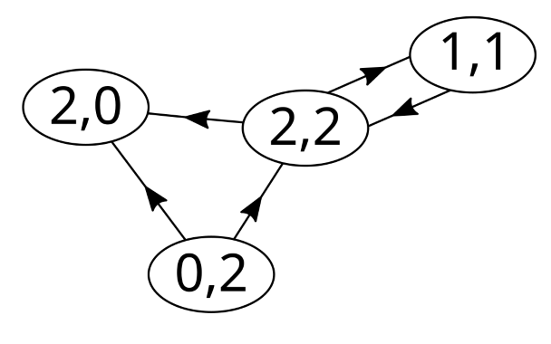
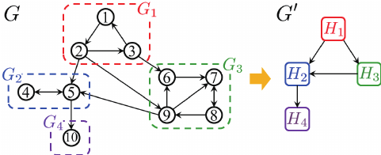
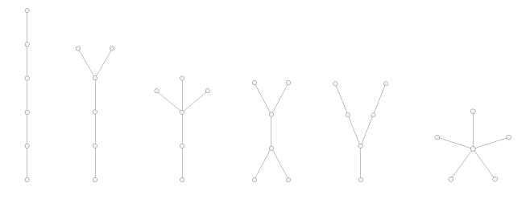
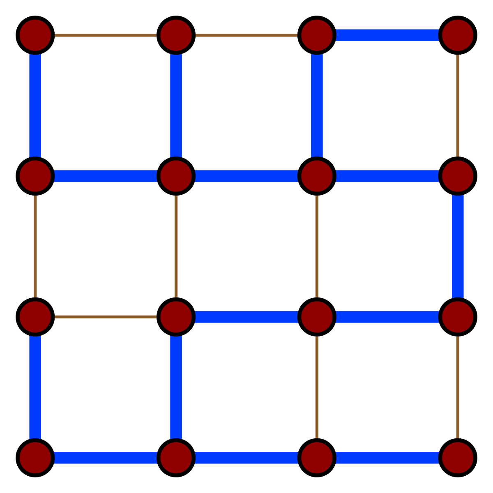

# Programación Orientada a Objetos

Este repositorio contiene la implementación en C++ de los algoritmos [Dijkstra](./Dijkstra.cpp) y [Bellman-Ford](./Bellman-Ford.cpp) utilizando funciones. Además, se incluye la implementación de la clase `Grafo` en C++, organizada en dos archivos principales:

- **[Grafo.h](./Grafo.h):** Archivo de cabecera que contiene las declaraciones de la clase y sus métodos. Este archivo define la interfaz pública, permitiendo que otros módulos o programas utilicen la clase sin conocer los detalles internos de su implementación.
- **[Grafo.cpp](./Grafo.cpp):** Archivo de implementación que contiene las definiciones de los métodos declarados en el archivo de cabecera. En este archivo también se encuentra la función `main`, la cual se utiliza para probar el correcto funcionamiento de la clase.

# Definiciones en Teoría de Gráficas

## Gráfica
Una **gráfica** es una estructura matemática compuesta por:
- Un conjunto de **vértices** (o nodos).
- Un conjunto de **aristas** que conectan pares de vértices.

## Ejercicio 1 
- Implementa el método `EliminarVertice` en la clase `Grafo` de forma que la gráfica resultante de quitar un vértice sea la gráfica sin el vértice y sin todas las aristas conectadas a él.
- Implementa el método `EliminarArista` en la clase `Grafo` de forma que la gráfica resultante sea la gráfica anterior sin la arista, es decir, los vértices a los que estaba conectada se quedan en la gráfica.

Las gráficas se utilizan para modelar relaciones entre objetos y pueden ser:

- **No dirigidas:** Las aristas no tienen una dirección específica, por lo que la conexión entre dos vértices es bidireccional.
- **Dirigidas (digráficas):** Cada arista tiene una dirección definida, lo que implica que la relación entre los vértices es unidireccional.

<figure>
  
  <figcaption>(a) Gráfica No dirigida (b) Gráfica Dirigida</figcaption>
</figure>

## Grado
El **grado** de un vértice mide la cantidad de aristas que inciden en él:

- En una gráfica **no dirigida**, el grado de un vértice $v$ es el número de aristas incidentes al vértice. Usualmento lo denotamos como $d(v)$.
- En una gráfica **dirigida** se distinguen dos conceptos:
  - **Grado de entrada (Ingrado):** Número de aristas que llegan al vértice. Denotado como $d^-(v)$.
  - **Grado de salida (Exgrado):** Número de aristas que salen del vértice. Denotado como $d^+(v)$.

<figure>

<!-- <figcaption>Digráfica con vertices etiquetados de forma $(d^-(v),d^+(v))$</figcaption> -->
</figure>

Digráfica con vertices etiquetados de forma $(d^-(v),d^+(v))$

## Ejercicio 2
- Implementa el método `grado` en la clase `Grafo` de forma que regrese una lista(vector) con los grados de cada vértice.
- Implementa el método `grado` en la subclase `GrafoDirigido` de forma que regrese una lista con los ingrados y exgrados de los vértices.
- Prueba los métodos con la gráfica que esta en la imágen. 

## Componente Conexa
Una **componente conexa** en una gráfica no dirigida es un subgrafo maximal en el que existe un camino entre cualquier par de vértices. Es decir:
- Todos los vértices de la componente están conectados entre sí.
- No existe un camino que conecte un vértice de la componente con un vértice que no pertenezca a ella.

<figure>

<figcaption>Componentes conexas(distinguidas por colores) en una digráfica</figcaption>
</figure>


## Ejercicio 3 
- Implementa el método `ComponentesConexas` en la clase `Grafo` de forma que regrese las componentes conexas del grafo.

## Componente Fuertemente Conexa
En una gráfica dirigida, una **componente fuertemente conexa** es un subgrafo maximal que cumple que para cualquier par de vértices **u** y **v** dentro de la componente:
- Existe un camino dirigido de **u** a **v**.
- Existe un camino dirigido de **v** a **u**.

Esto garantiza que todos los vértices de la componente están interconectados en ambas direcciones.

<figure>
  
  <figcaption>(a) Una digráfica y (b) Sus componentes fuertemente conexas </figcaption>
</figure>

## Ejercicio 4
- Implementa el método `ComponentesFuertementeConexas`en la subclase `GrafoDirigido` de forma que regrese las componentes fuertemente conexas de la gráfica. 
- Prueba los métodos con la gráfica que esta en la imágen. 

## Condensación de una Digráfica
La **condensación** de una digráfica es una nueva digráfica que se obtiene contrayendo cada componente fuertemente conexa en un único vértice. En esta condensación:
- Se representa cada componente fuertemente conexa como un solo vértice.
- Se establece una arista entre dos vértices (componentes) si existe al menos una arista en la digráfica original que conecte algún vértice del primer componente con algún vértice del segundo.

La condensación simplifica la estructura de la digráfica, mostrando de manera compacta la relación entre sus componentes fuertemente conexas.

<figure>
  
  <figcaption>(a) Condensación G' de la Digráfica G </figcaption>
</figure>

## Ejercicio 5 
- Implementa el método `Condensacion` en la subclase `GrafoDirigido` tal que te regrese otro objeto de tipo `GrafoDirigido` con su condesación.

## Árbol
Un **árbol** es una gráfica que es:
- **Conexa:** Existe al menos un camino entre cualquier par de vértices.
- **Acíclica:** No contiene ciclos, es decir, no es posible partir de un vértice y regresar a él recorriendo una secuencia de aristas sin repetir vértices.

En otras palabras, un árbol es una estructura jerárquica sin ciclos, donde la conexión entre nodos es única.

<figure>
  
  <figcaption>Árboles con 6 vértices</figcaption>
</figure>

## Árbol Generador
Un **árbol generador** (o árbol de expansión) de una gráfica es un subgrafo que:
- Incluye **todos** los vértices de la gráfica original.
- Es un árbol, es decir, es conexo y acíclico.

El árbol generador proporciona una manera de conectar todos los vértices de la gráfica utilizando el menor número de aristas posible. En algunas aplicaciones se busca el árbol generador de peso mínimo (conocido como Árbol de Expansión Mínima).

Un árbol generador de una gráfica **G** es un árbol que incluye todos los vértices de **G**.

<figure>
  
  <figcaption>Árbol generador(en azul) de una malla de 4 x 4</figcaption>
</figure>

## Ejercicio 6

Implementa el método `ArbolGeneradorMinimo` en la clase `Grafo` para obtener el árbol generador de la gráfica, utilizando los algoritmos Dijkstra y Bellman-Ford.

## Ejercicio 7
- Implementa el método `AlrbolesGeneradores` en la clase `Grafo` que encuentre todos los posibles árboles generadores de una gráfica. Su retorno debe ser un vector de vectores con todos los árboles generadores posibles.
- Sobrecarca el método `AlrbolesGeneradores` en la subclase `GrafoDirigido` para que encuentre todos los posibles árboles generadores de una gráfica dirigida.

## Ejercicio Extra 1
La resta entre dos gráficas $G$ y $H$, $G$ \ $H$ está dada por la gráfica $G$ sin los vertices de $H$.
- Implementa el método `resta` en la clase `Grafo` de dos formas:
    - Que su argumento sea la lista de adyancencia
    - Que su argumento sea un objeto de la clase `Grafo` 
- Usa los métodos del Ejercicio 3 para implementar el método.

## Ejercicio Extra 2
 - Crea un archivo `Grafo.py` donde implementes una clase `Grafo` analoga a la clase con el mismo nombre en c++.
 - Prueba la clase con un archivo `main.py` usando los siguientes grafos para el algoritmo de Dijkstra y Bellman-Ford respectivamente:
 ```python 
 grafo = {
    'A': [('B', 1), ('C', 3), ('D', 14)],
    'B': [('A', 1), ('C', 3), ('E', 8), ('J', 3), ('F', 5)],
    'C': [('A', 3), ('B', 3), ('D', 8), ('E', 4), ('G', 3), ('H', 9)],
    'D': [('A', 14), ('C', 8), ('H', 10), ('I', 8)],
    'E': [('B', 8), ('C', 4), ('G', 3), ('J', 1)],
    'F': [('B', 5), ('J', 6)],
    'G': [('C', 3), ('H', 4), ('L', 4), ('K', 2), ('J', 8), ('E', 3)],
    'H': [('C', 9), ('D', 10), ('I', 6), ('L', 7), ('G', 4)],
    'I': [('D', 8), ('H', 6), ('L', 8), ('M', 2)],
    'J': [('F', 6), ('E', 1), ('G', 8), ('K', 8)],
    'K': [('J', 8), ('G', 2), ('L', 6)],
    'L': [('K', 6), ('G', 4), ('H', 7), ('I', 8), ('M', 4)],
    'M': [('L', 4), ('I', 2)]    
   }
``` 

```python 
grafoDirigido = { 
    "A": [("B", 1), ("C", 12), ("E", 4)],
    "B": [("G", 5), ("D", 1)],
    "C": [("H", 4)],
    "D": [("F", 0), ("C", -9), ("H", 3), ("G", 2)],
    "E": [("B", 2), ("F", -8)],
    "F": [ ],
    "G": [("H", 6)],
    "H": [ ] }
```